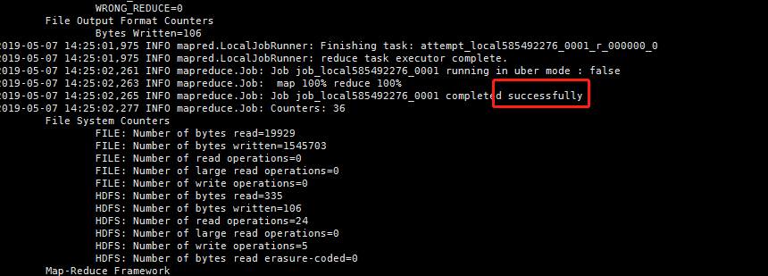

## 一、安装hadoop集群

## 二、运行hdfs

## 三、创建项目文件夹

    ./hadoop-3.2.0/bin/hadoop fs -mkdir /wordcount/input

## 四、上传文件

    ./hadoop-3.2.0/bin/hadoop fs -put text1.txt text2.txt /wordcount/input
    
## 五、执行jar文件

    ./hadoop-3.2.0/bin/hadoop jar demo-wordc-0.0.1.jar demo.App /wordcount/input /wordcount/output
    
## 六、观察日志

## 七、查看结果

    ./hadoop-3.2.0/bin/hadoop fs -ls /wordcount/output
    ./hadoop-3.2.0/bin/hadoop fs -cat /wordcount/output/part-r-00000